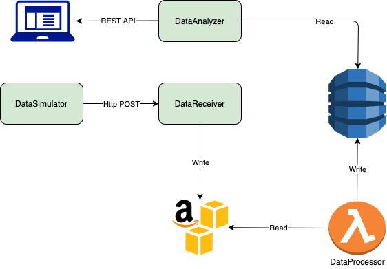
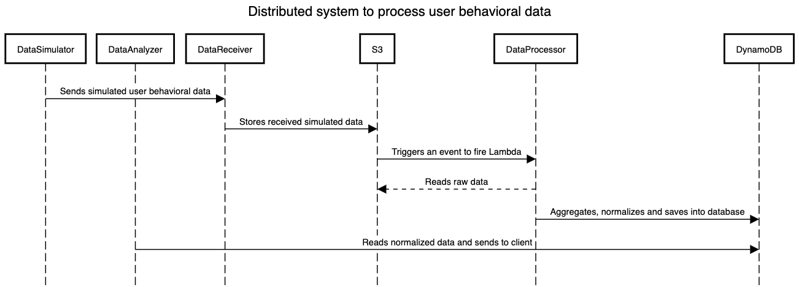

## Introduction

The DataSimulator microservice provides REST API. The API are being used to simulate user behavioral data. The responsibility of this microservice is to generate user behavioral data(user clicks) and send them to DataReceiver microservice, so it wwill be processed further. More info can be found by checking the swagger UI.

## Architecture diagram of the whole system

## Sequence diagram of the whole system

#### Environmental variables      
| ENV Variable | Description |
| ------------ | ----------- |
| NODE_ENV | Environment in which microservice will run. |
| PORT | The port where the service will be listening to |
| LOG_LEVEL | Log level |

#### Run service locally
###### In order to run service, follow these simple steps:
    1. npm install
    2. Provide list of env variables in 'root/.env-dev' file with following format: envVar=value
    3. npm start

#### Check available APIs
After running the service locally, go to your browser and see the APIs with this Url: http://localhost:8080/swagger

#### Maintainer contact
- vahagsaribeyan@gmail.com